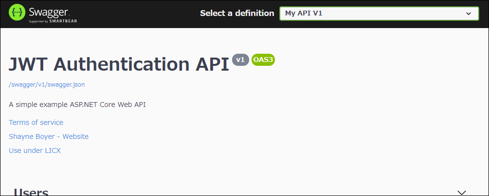
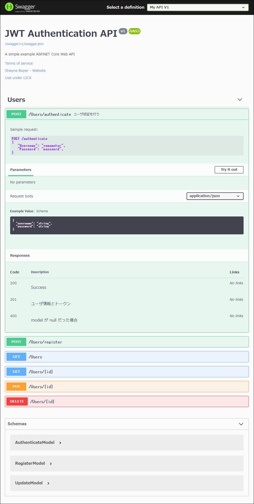

# ASP.NET Core アプリに Swagger を導入する方法

参照: SwashbuckleとASP.NETCoreの使用を開始する  
https://docs.microsoft.com/en-us/aspnet/core/tutorials/getting-started-with-swashbuckle?view=aspnetcore-3.1&tabs=netcore-cli

## Swagger とは
Swagger とは、RESTful API の作成を補助するオープンソースのフレームワークのこと。 また、このフレームワークにおいて標準化されているドキュメント仕様そのものを指す言葉でもある。

## Swashbuckle
ASP.NET Core で Swagger を使うには、Swashbuckle パッケージを使う。

Swashbuckle には、次の 3 つの主要コンポーネントがある。

- **Swashbuckle.AspNetCore.Swagger**：  
SwaggerDocument オブジェクトを JSON エンドポイントとして公開するための Swagger オブジェクトモデルとミドルウェア。

- **Swashbuckle.AspNetCore.SwaggerGen**：  
SwaggerDocument ルート、コントローラー、およびモデルから直接オブジェクトを構築する Swagger ジェネレータ。通常、Swagger エンドポイントミドルウェアと組み合わせて、SwaggerJSON を自動的に公開する。

- **Swashbuckle.AspNetCore.SwaggerUI**：  
SwaggerUI ツールの埋め込みバージョン。Swagger JSON を解釈して、WebAPI 機能を記述するための豊富でカスタマイズ可能なエクスペリエンスを構築する。これには、パブリックメソッド用の組み込みテストハーネスが含まれている。

## パッケージのインストール
Swashbuckle は、次の方法で追加できる。

### VSCode の場合
Nuget Package Manager で Swashbuckle 5.5.0 を追加する。

### .NET Core CLI の場合
```console
dotnet add TodoApi.csproj package Swashbuckle.AspNetCore -v 5.5.0
```

## Swaggerミドルウェアを追加・構成する
Startup.ConfigureServices メソッドのサービスコレクションに Swagger ジェネレーターを追加する。

Startup.cs:
```csharp
public void ConfigureServices(IServiceCollection services)
{
    // 1 つ以上の SwaggerDocument を定義して、Swagger ジェネレータを登録する
    services.AddSwaggerGen();
}
```

Startup.Configure メソッドで、生成された JSON ドキュメントと SwaggerUI を提供するためのミドルウェアを有効にする。
Startup.cs:
```csharp
public void Configure(IApplicationBuilder app)
{
    // 生成された Swagger を JSON エンドポイントとして提供するミドルウェアに対して有効にする
    app.UseSwagger();

    // ミドルウェアが swagger-ui（HTML、JS、CSSなど）を提供することを有効にする。
    // Swagger JSONエンドポイントを指定する。
    app.UseSwaggerUI(c =>
    {
        c.SwaggerEndpoint("/swagger/v1/swagger.json", "My API V1");
    });

    app.UseRouting();
    app.UseEndpoints(endpoints =>
    {
        endpoints.MapControllers();
    });
}
```

この UseSwaggerUI メソッド呼び出しにより、静的ファイルミドルウェアが有効になる。

アプリを起動し、`http://localhost:<port>/swagger/v1/swagger.json` に移動する。
SwaggerUI は http://localhost:<port>/swagger にある。Swagger UI を介して API を探索し、他のプログラムに組み込む。

アプリのルート（http://localhost:<port>/）で Swagger UI を提供するには、RoutePrefix プロパティを空の文字列に設定する。

Startup.Configure メソッド:
```csharp
app.UseSwaggerUI(c =>
{
    c.SwaggerEndpoint("/swagger/v1/swagger.json", "My API V1");
    c.RoutePrefix = string.Empty;
});
```

## カスタマイズする
Swagger には、オブジェクトモデルを文書化し、テーマに合わせて UI をカスタマイズするためのオプションが用意されている。Startup クラス、次の名前空間を追加します。

Startup.cs
```csharp
using System;
using System.Reflection;
using System.IO;
```

### API情報と説明
AddSwaggerGen メソッドに渡される構成アクションには、作成者、ライセンス、説明などの情報を追加できる。Startup クラスで、クラスを使用するには、OpenApiInfo の名前空間をインポートする。

Startup.cs
```csharp
using Microsoft.OpenApi.Models;
```

OpenApiInfo クラスを使用して、UI に表示される情報を、以下の通り変更する。

Startup.cs
```csharp
// 1 つ以上の SwaggerDocument を定義して、Swagger ジェネレータを登録する
services.AddSwaggerGen(c =>
{
    c.SwaggerDoc("v1", new OpenApiInfo
    {
        Version = "v1",
        Title = "ToDo API",
        Description = "A simple example ASP.NET Core Web API",
        TermsOfService = new Uri("https://example.com/terms"),
        Contact = new OpenApiContact
        {
            Name = "Shayne Boyer",
            Email = string.Empty,
            Url = new Uri("https://twitter.com/spboyer"),
        },
        License = new OpenApiLicense
        {
            Name = "Use under LICX",
            Url = new Uri("https://example.com/license"),
        }
    });
});
```

Swagger UI は、バージョンの情報を表示する。  


### XMLコメント
.csproj ファイルに次の記述を追加する。
```csharp
<PropertyGroup>
  <GenerateDocumentationFile>true</GenerateDocumentationFile>
  <NoWarn>$(NoWarn);1591</NoWarn>
</PropertyGroup>
```

生成された XML ファイルを使用するように Swagger を構成する。

ConfigureServices メソッド
```csharp
public void ConfigureServices(IServiceCollection services)
{
    // // 1 つ以上の SwaggerDocument を定義して、Swagger ジェネレータを登録する
    services.AddSwaggerGen(c =>
    {
        c.SwaggerDoc("v1", new OpenApiInfo
        {
            Version = "v1",
            Title = "ToDo API",
            Description = "A simple example ASP.NET Core Web API",
            TermsOfService = new Uri("https://example.com/terms"),
            Contact = new OpenApiContact
            {
                Name = "Shayne Boyer",
                Email = string.Empty,
                Url = new Uri("https://twitter.com/spboyer"),
            },
            License = new OpenApiLicense
            {
                Name = "Use under LICX",
                Url = new Uri("https://example.com/license"),
            }
        });

        // Swagger の JSON と UI のコメントパスを設定する
        string xmlFile = $"{Assembly.GetExecutingAssembly().GetName().Name}.xml";
        string xmlPath = Path.Combine(AppContext.BaseDirectory, xmlFile);
        c.IncludeXmlComments(xmlPath);
    });
}
```

上記のコードでは、Reflection を使用して、WebAPI プロジェクトの名前と一致する XML ファイル名を作成している。AppContext.BaseDirectory プロパティは、XML ファイルへのパスを構築するために使用される。一部の Swagger 機能（たとえば、入力パラメーターまたは HTTP メソッドのスキーマとそれぞれの属性からの応答コード）は、XML ドキュメントファイルを使用せずに機能する。ほとんどの機能、つまりメソッドの要約とパラメーターおよび応答コードの説明では、XML ファイルの使用が必須となる。

### SwaggerUI の強化
アクションにトリプルスラッシュコメントを追加すると、セクションヘッダーに説明が追加され、SwaggerUI が強化される。

Controller
```csharp
/// <summary>
/// ユーザ認証を行う
/// </summary>
/// <remarks>
/// Sample request:
///
///     POST /authenticate
///     {
///        "Username": "yamamotor",
///        "Password": "password",
///     }
///
/// </remarks>
/// <param name="model"></param>
/// <returns>ユーザ情報とトークン</returns>
/// <response code="201">ユーザ情報とトークン</response>
/// <response code="400">model が null だった場合</response>    
[AllowAnonymous]
[HttpPost("authenticate")]
public IActionResult Authenticate([FromBody] AuthenticateModel model)
{
    return Ok(new
    {
        Id = user.Id,
        Username = user.Username,
        FirstName = user.FirstName,
        LastName = user.LastName,
        Token = tokenString
    });
}
```


